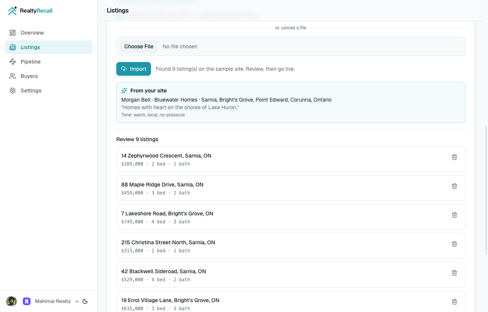
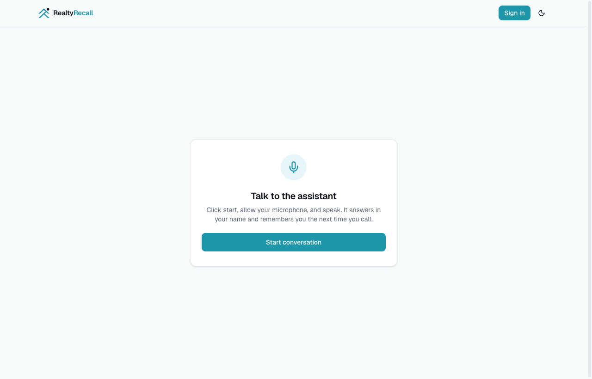
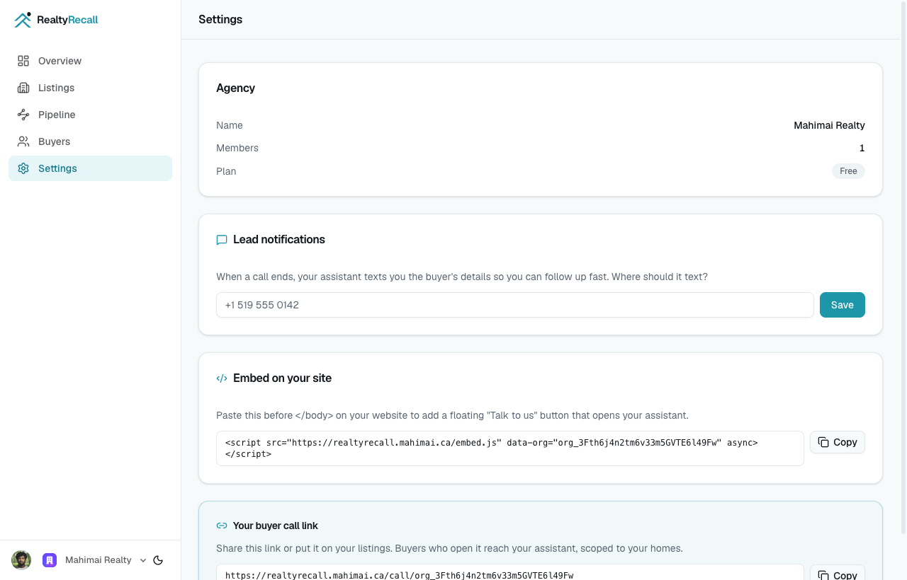
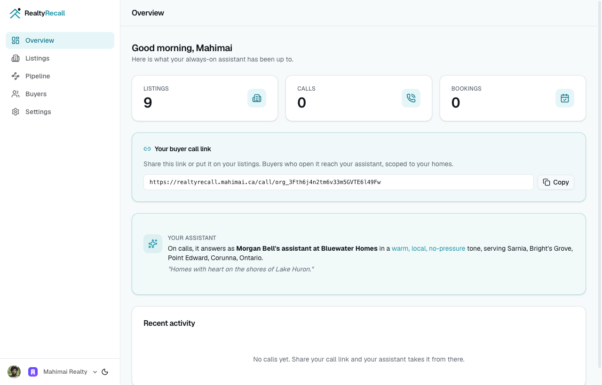
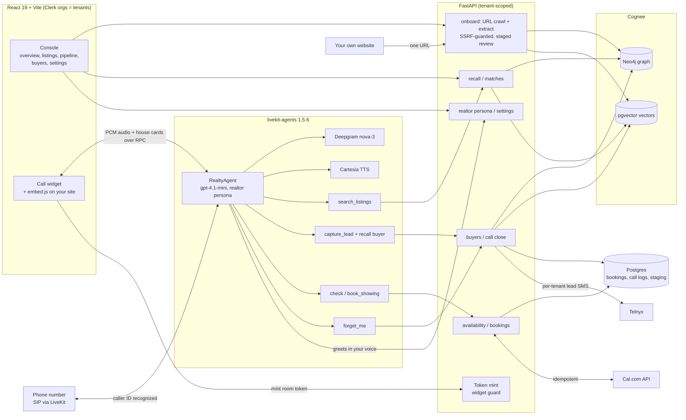

<div align="center">


# RealtyRecall

**The always-on voice receptionist for solo real estate agents: it answers every call in your name, qualifies the buyer, books the showing, and never forgets a caller.**

<p>
  <a href="https://realtyrecall.mahimai.ca"></a>
  
  
  
  
  
  <a href="LICENSE"></a>
</p>

[Live demo](https://realtyrecall.mahimai.ca) · [Quick start](#quick-start) · [Architecture](#architecture) · [Memory](#memory-that-carries-across-calls)

</div>

---

## The problem

A solo agent answers their own phone, and a phone that rings during a showing goes to voicemail. Nearly half of buyer inquiries never get a response at all, and the average agent takes more than fifteen hours to answer the ones they do. Speed is the whole game: reaching a new lead within five minutes makes an agent as much as 21 times more likely to win it, and most buyers simply go with whoever calls back first. Yet 62% of inquiries land outside business hours, exactly when a solo agent cannot pick up.

The usual fallback is worse than silence. Answering services read from a script and forget the caller the second they hang up, so a buyer who called on Monday is a stranger again on Thursday. The lead goes cold three small ways: a call that drops to voicemail, a buyer who gives up and dials the next agent, a follow-up that never gets made.

RealtyRecall gives every solo agent a receptionist that has actually read their listings, answers around the clock in their name, and remembers every buyer and every home across calls. The buyer stays in control: a returning caller is greeted by name and picks up exactly where they left off.

<sub>Sources: WAV Group agent responsiveness study (no response to ~48% of inquiries; ~15 hour average); lead-response research from RealTrends and InsideSales (5 minute / 21x, first responder wins).</sub>

## What it does

| | |
|---|---|
| **Onboards from one URL** | Paste your website and RealtyRecall crawls it (SSRF-guarded, same-host, bounded), extracts every listing from structured data first (JSON-LD, OpenGraph, DOM) with an LLM fallback, and infers who you are: name, agency, area, tagline, tone. You review everything before it goes live. No site handy? One click crawls our [sample realtor site](https://bluewater-homes-demo.vercel.app). |
| **Answers in your name, and your voice** | A LiveKit voice agent picks up every call, discloses that it may be recorded, and qualifies budget, timeline, financing, and area one question at a time. The persona inferred from your own site shapes the greeting and tone, so it answers as "your assistant at your agency", not a generic bot. It only ever describes homes you have connected, and never invents a price or a detail. |
| **Remembers every buyer, across calls** | Buyers and listings live in a Cognee knowledge graph, not a transcript. A returning caller is recognized by phone (automatically on a phone line, or the moment they give their number on the web), greeted back by name, and matched to homes using everything earlier calls revealed. |
| **Talks along on screen** | On a web call the buyer's screen keeps up with the conversation over LiveKit RPC: house cards appear as homes are discussed, the booking confirms visually, and the lead handoff shows on a simulated phone panel. |
| **Books real showings** | `check_availability` and `book_showing` run against your real Cal.com calendar inside your follow-up window. Every booking is keyed by an idempotency key, so a retried request never creates a second showing. |
| **Hands you the lead instantly** | When the call ends, RealtyRecall folds the conversation back into memory and texts the buyer and outcome to your own number (set per agency in Settings) over Telnyx, so you can follow up while the lead is still warm. |
| **Lives where your buyers are** | A one-line `embed.js` snippet puts a floating "Talk to us" button on your own website, and a real phone number can ring the same assistant over SIP (`infra/sip/`). |
| **Forgets on request** | A caller can ask to be forgotten and their entire Cognee dataset is deleted. The `forget_me` tool derives the phone from the verified caller, never from the model, so deletion can only ever hit that caller's own record. |

<table>
  <tr>
    <td width="50%"></td>
    <td width="50%"></td>
  </tr>
  <tr>
    <td align="center"><sub>Paste one URL: every listing plus your persona, extracted from your own site and staged for review</sub></td>
    <td align="center"><sub>Answer every call in your name, voice first</sub></td>
  </tr>
  <tr>
    <td width="50%"></td>
    <td width="50%"></td>
  </tr>
  <tr>
    <td align="center"><sub>Lead texts to your own number, and a one-line embed for your website</sub></td>
    <td align="center"><sub>One dashboard: your assistant's persona, call link, listings, and pipeline</sub></td>
  </tr>
</table>

## Demo

> Watch the demo: **[link coming with the build log]**

Fastest way to try it yourself: open the [live demo](https://realtyrecall.mahimai.ca), sign in, and on the Listings page either paste your own site's URL or click "Try it with our sample site" (a synthetic realtor site at [bluewater-homes-demo.vercel.app](https://bluewater-homes-demo.vercel.app) with nine homes). Review what was extracted, go live, and call in. The assistant answers in the realtor's name and tone, qualifies you, and recommends the homes that fit while your screen talks along. Give it your name and number, hang up, call back and give your number again: it greets you by name and picks up where you left off. Ask it to forget you, and it does.

## Architecture

One LiveKit voice agent runs the whole call. Identity, listing search, lead capture, booking, and forget are tools on a single agent, and the backend keeps memory and bookings behind one guarded API, so the same rules apply whether a buyer speaks or types.



Key decisions worth a look:

- **Memory is the system of record.** Listings and buyers live in Cognee's graph and vectors, not just a database row. `recall` matches a buyer to homes across sessions, and `improve` folds each finished call back in, so the memory sharpens with every conversation.
- **Multi-tenant by construction.** A Clerk organization is the tenant. Every memory node is tagged with the tenant's NodeSet, every operational row carries `tenant_id`, console endpoints resolve the tenant from the Clerk JWT, and agent endpoints trust `X-Tenant-Id` only alongside a shared agent secret. One realtor can never see another's buyers or homes.
- **Crawling a stranger's URL is treated as hostile.** The onboarding crawler requires explicit consent, resolves DNS once and pins the connection to that vetted public IP (so DNS rebinding cannot reach internal services), re-validates every redirect hop, streams bodies with a hard size cap, and stays on the seed's host with page and LLM budgets.
- **Verified before anything runs.** Public endpoints sit behind a widget guard: an origin allowlist, a per-IP sliding-window rate limit on a monotonic clock, and short-lived room tokens. The agent acts for one caller, identified per call.
- **Bookings cannot double.** Every booking carries an idempotency key, and the Cal.com POST is never retried on a 5xx, so a flaky network can never write a second showing to your calendar.
- **Tools talk to the backend, not to the model's imagination.** The agent's tools call a typed backend API; the model only ever describes homes the tools actually return.
- **Staging survives a restart.** The onboarding review buffer is a Postgres row per tenant, so the set you reviewed is exactly the set that goes live, across deploys and workers.
- **Cognee is isolated.** Cognee runs in its own `cognee_db` on the same Postgres; the operational app database (bookings, call logs, staging) has no vector dependency, so the two never collide.

## Memory that carries across calls

RealtyRecall's memory runs on [Cognee](https://github.com/topoteretes/cognee), a self-hosted, open-source memory layer: a hybrid of a Neo4j knowledge graph and pgvector embeddings. Five node types model the business: Realtor, Listing, Neighbourhood, Buyer, and Showing. Four operations run the entire product:

- **remember.** Onboarding ingests the realtor's listings, and every caller becomes a Buyer node with their criteria and history.
- **recall.** A buyer is matched to the homes that fit, across sessions, using graph and vector retrieval rather than a single keyword query.
- **improve.** When a call closes, the conversation is folded back in so the latest understanding of the buyer wins.
- **forget.** A buyer is removed completely on request.

Three deliberate choices keep memory safe and honest:

- **Per-buyer datasets.** Each buyer gets their own Cognee dataset keyed by phone, so `forget` deletes exactly one person without touching another buyer's memory.
- **Verified-caller forget.** The `forget_me` tool reads the phone from the verified caller in session state, never from a model argument, so a prompt injection cannot aim deletion at someone else.
- **Graceful degradation.** Folding a call into memory on close is best-effort: if the memory layer is briefly unavailable, the call still closes and the lead SMS still sends, rather than failing the caller.

## Built in public for the Cognee hackathon

RealtyRecall is being built in the open for The Hangover Part AI, the Cognee memory hackathon (Jun 29 to Jul 5, 2026). It grew out of a done-for-you voice-AI practice ([mahimai.ca](https://mahimai.ca)) into a product any solo agent can run.

Cognee is not a logo on the page. It is the system of record: the graph and vectors that turn a returning buyer into a known buyer instead of a fresh transcript. Take Cognee out and RealtyRecall is just another answering service that forgets you.

## Tech stack

| Layer | Technology |
|---|---|
| Voice agent | livekit-agents 1.5.6, Deepgram `nova-3` (STT), OpenAI `gpt-4.1-mini` (LLM), Cartesia (TTS), Silero VAD, multilingual turn detection |
| Memory | Cognee 1.2.2 (graph + vector), Neo4j, pgvector, OpenAI embeddings |
| Backend | Python 3.11, FastAPI, SQLModel, asyncpg, Alembic, dependency-injector, PyJWT |
| Onboarding crawler | httpx (IP-pinned transport), selectolax, OpenAI structured outputs, Jina Reader fallback for client-rendered sites |
| Auth + tenancy | Clerk (organizations = tenants), agent-secret gate for the voice worker |
| Data | PostgreSQL (operational), Neo4j (graph), pgvector (vectors) |
| Scheduling + SMS | Cal.com API v2 (slots, bookings), Telnyx Messaging v2 |
| Frontend | React 19, Vite, TypeScript, React Router 7, Tailwind CSS v4, LiveKit components |
| Telephony | LiveKit SIP (inbound trunk + per-realtor dispatch rules in `infra/sip/`) |
| Quality | pytest (139 unit + 9 integration backend, 53 agent), ruff, mypy, ESLint, TypeScript strict, vitest (10 frontend), GitHub Actions CI/CD |

## Quick start

Prerequisites: [Docker](https://www.docker.com/), Python 3.11+, Node.js 22+, [uv](https://docs.astral.sh/uv/), [pnpm](https://pnpm.io/).

```bash
git clone https://github.com/mahimairaja/RealtyRecall.git
cd RealtyRecall
cp .env.example .env             # fill in the keys below
docker compose up -d db neo4j    # Postgres (pgvector) + Neo4j
```

### 1. Backend

```bash
cd backend
uv sync
uv run alembic upgrade head
uv run uvicorn src.main:app --reload --port 8000
```

API docs at `http://localhost:8000/docs` once running.

| Variable | Required | Notes |
|---|---|---|
| `OPENAI_API_KEY` | yes | LLM for the agent and Cognee embeddings |
| `LIVEKIT_URL`, `LIVEKIT_API_KEY`, `LIVEKIT_API_SECRET` | yes | Voice transport and room tokens |
| `DEEPGRAM_API_KEY`, `CARTESIA_API_KEY` | yes | Speech to text and text to speech |
| `GRAPH_DATABASE_*`, `NEO4J_PASSWORD` | yes | Cognee graph store (Neo4j) |
| `JWT_SECRET_KEY` | yes | Signs room and auth tokens |
| `CLERK_ISSUER` | yes (console) | Verifies console session JWTs; the realtor dashboard needs it |
| `AGENT_SERVICE_SECRET` | recommended | Shared secret so the voice worker can act for a tenant |
| `CAL_API_KEY`, `RR_CAL_EVENT_TYPE_ID` | optional | Real booking; the calendar degrades gracefully without them |
| `TELNYX_API_KEY`, `TELNYX_FROM_NUMBER` | optional | Lead handoff SMS; each realtor sets their own number in Settings (global `REALTOR_SMS_TO` is the fallback) |

Neo4j must have the APOC plugin enabled (local `docker-compose` already sets it; see `DEPLOY.md` for hosted Neo4j).

### 2. Seed the demo

```bash
cd backend
uv run python ../scripts/demo_seed.py   # 3 Sarnia listings + 1 returning buyer
```

### 3. Agent

```bash
cd agent
uv sync
uv run python main.py console           # talk to it from your terminal
```

Use `uv run python main.py dev` to connect the agent to a LiveKit room instead of the console.

### 4. Frontend

```bash
cd frontend
pnpm install
pnpm dev
```

Set `VITE_CLERK_PUBLISHABLE_KEY` in `frontend/.env` (the console throws without it), then open `http://localhost:5173`, sign in, connect listings (paste a URL or use the sample-site button), and call in.

## Testing

```bash
cd backend
uv run pytest -m "not integration"      # 139 unit tests, no live services
uv run ruff check . && uv run mypy src

cd agent
uv run pytest                           # 53 agent tests

cd frontend
pnpm lint && pnpm build && pnpm test    # eslint, tsc + vite build, 10 vitest
```

The 9 integration tests (marked `integration`) need live Cognee, Neo4j, pgvector, and OpenAI, so they run outside the fast gate.

## Project structure

```text
RealtyRecall/
├── agent/                 # LiveKit voice agent (livekit-agents 1.5.6)
│   └── src/
│       ├── agents/        # RealtyAgent: call tools + returning-buyer recall
│       ├── prompts/       # persona-aware voice instructions and guardrails
│       └── runtime/       # call observers, post-call hook
├── backend/               # FastAPI: API, memory, onboarding, bookings
│   ├── migrations/        # Alembic (tenants, bookings, call logs, staging)
│   └── src/
│       ├── api/           # token, onboard, listings, realtor, recall, buyers,
│       │                  # bookings, calls, settings, pipeline
│       ├── memory/        # Cognee store + graph model (Realtor, Listing, Buyer, ...)
│       ├── services/      # fetch (SSRF-safe crawl), ingest, llm extraction,
│       │                  # onboard staging, Cal.com, Telnyx SMS
│       └── core/          # config, Clerk auth, tenant gate, widget guard, DI
├── frontend/              # React 19 + Vite
│   ├── public/embed.js    # paste-on-your-site call widget loader
│   └── src/routes/        # overview, listings, pipeline, buyers, settings, call (+ /embed)
├── infra/sip/             # LiveKit inbound trunk + per-realtor dispatch rules
└── scripts/               # demo_seed.py
```

## Roadmap

- A live memory-graph view in the dashboard.
- Official listing feeds (MLS / IDX) once licensed, beyond the realtor's own connected listings.
- Billing (Stripe) for the multi-tenant SaaS tier.
- Headless rendering for heavily client-side sites, beyond the current reader fallback.
- More verticals on the same memory spine.

## 7-day build plan

Built in the open over the hackathon week (Jun 29 to Jul 5, 2026). M0, the full voice and memory loop (phases A to G), shipped in the first two days; the rest is depth, reliability, and story.

| Day | Date | Focus | Done |
|---|---|---|---|
| 1 | Jun 29 | Foundation: Cognee memory layer, operational DB, token mint + widget guard, the realty voice agent | `[x]` |
| 2 | Jun 30 | M0 features: onboarding, recall, booking, lead capture, memory behaviors, frontend (phases B to G) | `[x]` |
| 3 | Jul 1 | Hosted demo + product depth: deploy, tenant isolation, console dashboard, talk-along call UI, URL onboarding with the realtor persona, public sample site | `[x]` |
| 4 | Jul 2 | Hardening + SaaS tier: persisted staging, streaming caps, per-tenant lead SMS, first-run onboarding, embeddable widget, SIP inbound, returning-buyer recognition | `[x]` |
| 5 | Jul 3 | Reliability: call-path load test, cost guards, observability, graceful error recovery | `[ ]` |
| 6 | Jul 4 | Story: demo video, Devpost write-up, landing page polish | `[ ]` |
| 7 | Jul 5 | Submission: final QA, buffer, and stretch goals | `[ ]` |

## Build log

Day 4 of 7, building in the open. Follow along on [LinkedIn](https://www.linkedin.com/in/mahimairaja/) and [X](https://x.com/mahimaidev), or watch this repo.

A note on data: RealtyRecall works with the listings a realtor connects, with consent. Official MLS / IDX feeds come later, under license.

## License

[MIT](LICENSE)
